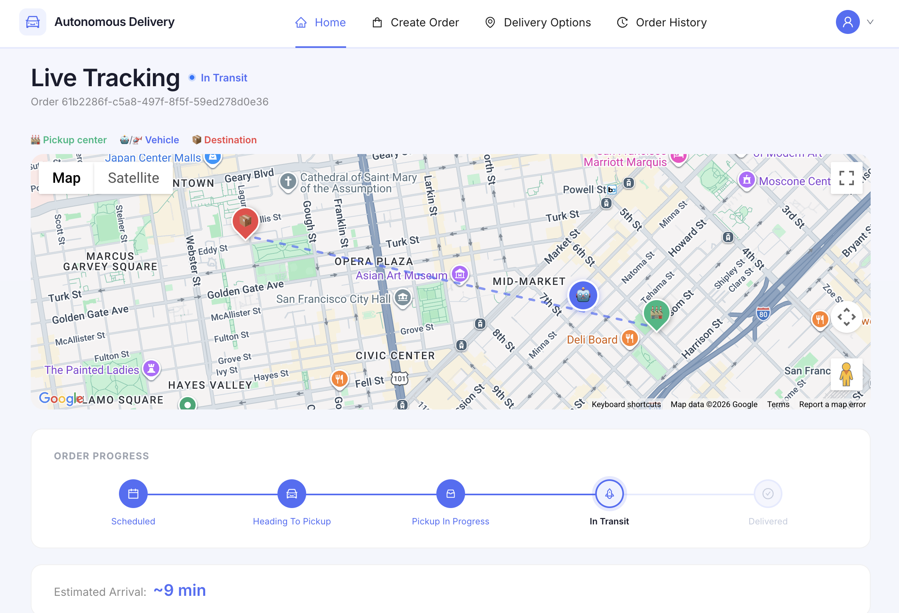
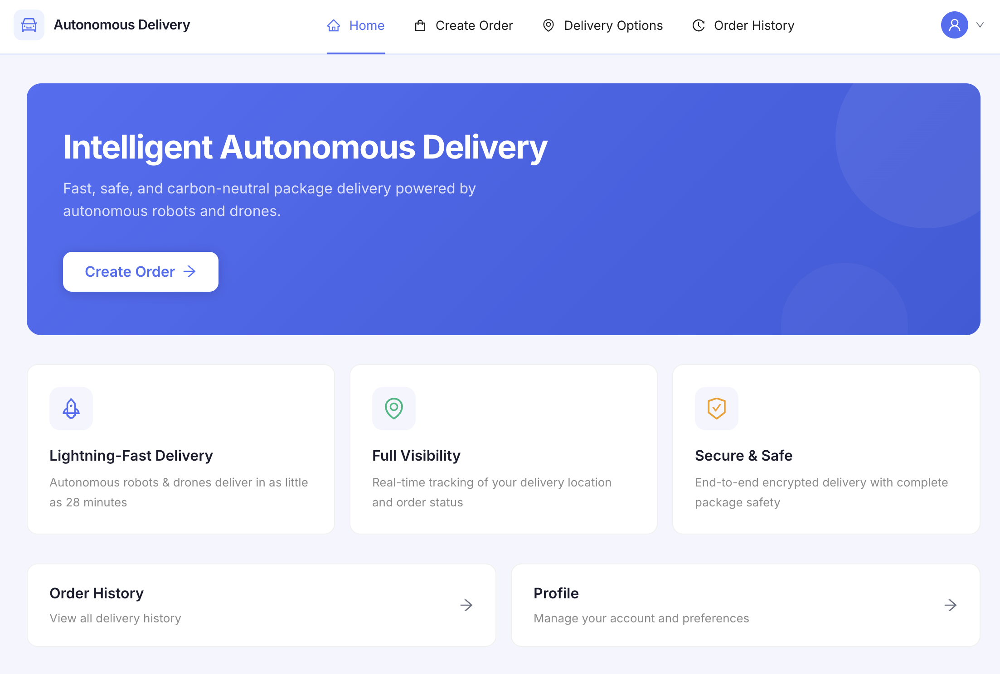
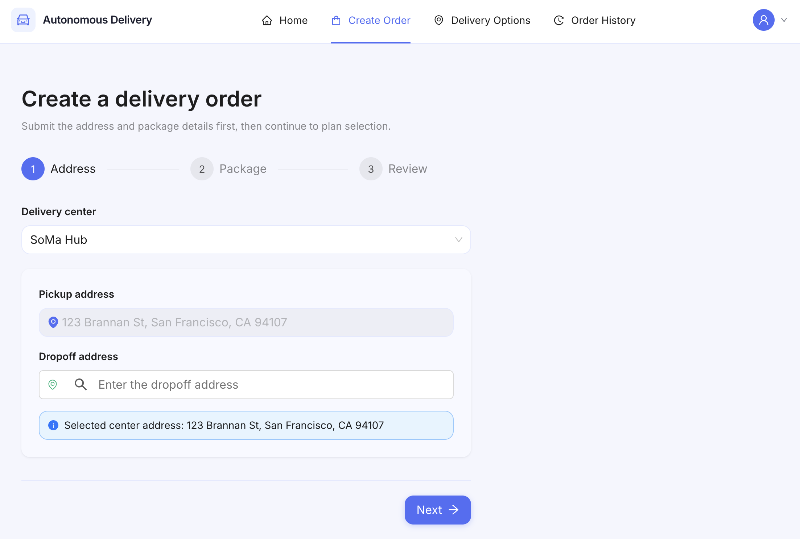
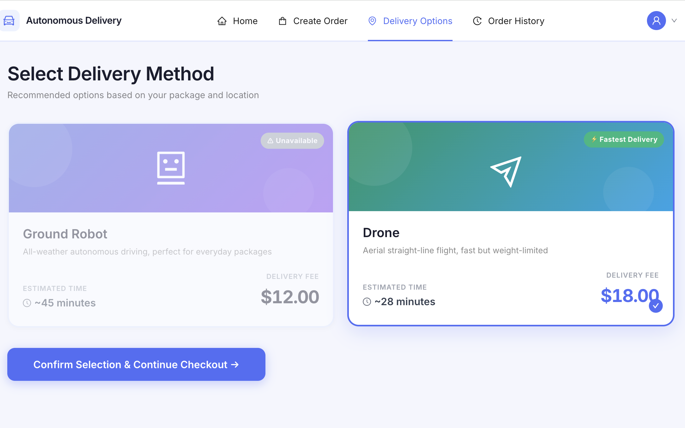
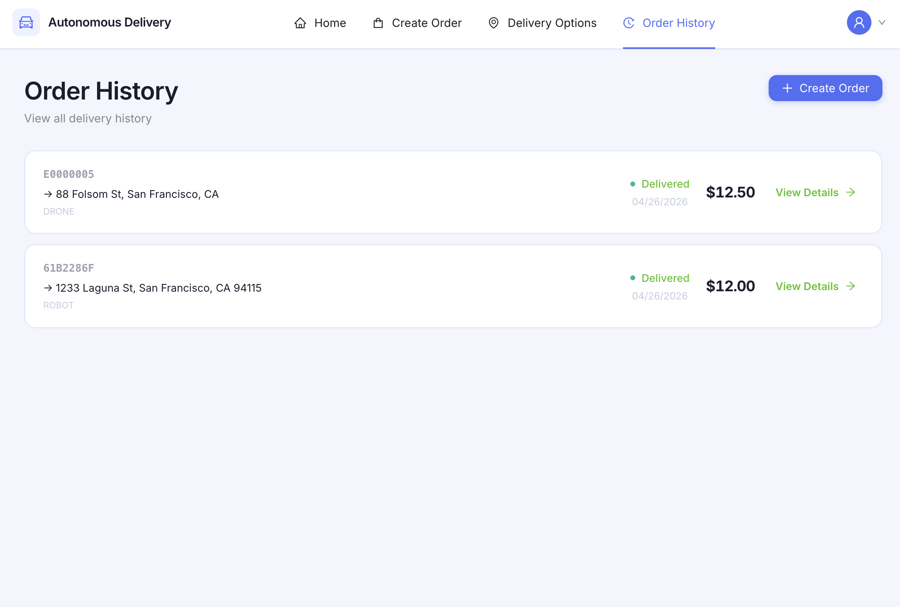

# DDMA — Autonomous Delivery System

A full-stack autonomous delivery platform with real-time fleet tracking. Customers create delivery orders, choose between ground robots and drones, complete payment, and watch their package travel across San Francisco on a live map — all powered by JWT + OTP authentication, OpenAPI-aligned services, and a containerized microservice deployment.

## Tech Stack

**Backend:** Java · Spring Boot · Spring Data JDBC · Spring Security · PostgreSQL · JWT · OpenAPI
**Frontend:** React · TypeScript · Vite · Ant Design · Google Maps JavaScript API · Places API (New)
**Infrastructure:** Docker · Docker Compose · Nginx

## Highlights

- **RESTful APIs** built with Spring Boot and Spring Data JDBC, backed by PostgreSQL — covers order processing, fleet vehicle management, and OTP-based authentication workflows.
- **Interactive React + TypeScript frontend** with Ant Design, integrating Google Maps JavaScript API and Places API (New) to visualize real-time vehicle position, routes, and delivery state transitions.
- **JWT + OTP authentication** with Spring Security, multi-service deployment via Docker Compose, and frontend/backend contracts aligned through OpenAPI in Agile sprints.

## Product Walkthrough

▶ [Click to watch the full demo video](https://youtu.be/wI8Dqh8cqq0)

### 1. Home

Landing page — value proposition and quick navigation to the order flow.

### 2. Create Order — Google Places Autocomplete

Address input is powered by Google's **Places API (New)** with `PlaceAutocompleteElement`, restricted to the San Francisco service area.

### 3. Delivery Options — Robot vs. Drone

Recommendation engine surfaces feasible vehicle types based on package weight and route.

### 4. Live Tracking

Real-time vehicle position on Google Maps with a step-by-step order progress timeline (Scheduled → Heading To Pickup → Pickup In Progress → In Transit → Delivered).

### 5. Order History

Past deliveries with status, vehicle type, total amount, and detail navigation.

---

## Local Development

See [`backend/DeliveryManagement/`](backend/DeliveryManagement/) for the Spring Boot service and [`frontend/`](frontend/) for the React app. Full setup, seed data, and auth API verification steps are documented below.

---